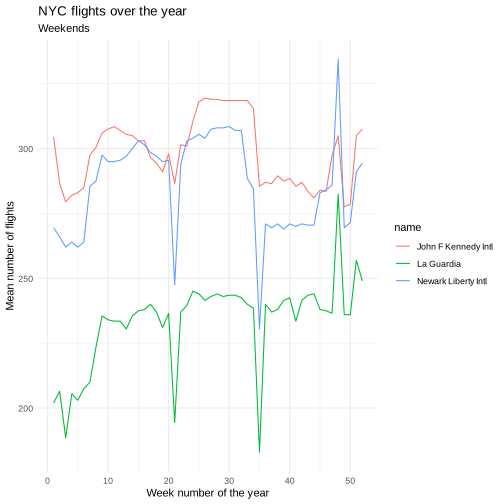

# Assignments for the Advanced Statistics for Physics Analysis course.
## M.Sc. Physics of Data @ UniPD. March ~ June 2023
### All exercises are in R.

Topics of the course:
- review of basic concepts: probability, odds and rules, updating probabilites, uncertain numbers (probability functions)
- from Bernoulli trials to Poisson processes and related distributions
- Bernoulli theorem and Central Limit Theorem
- Inference of the Bernoulli p; inference of lambda of the Poisson distribution. Inference of the Gaussian mu. Simultaneous inference of mu and sigma from a sample: general ideas and asymptotic results (large sample size).
- fits as special case of parametric inference
- Monte Carlo methods: rejecion sampling, inversion of cumulative distributions, importance sampling. Metropolis algorithm as example of Markov Chain Monte Carlo. Simulated annealing
- the R framework and language for applied statistics.

Short summary of the assignments:

## Assignment 1 - tidyverse



Analyze the flights offered by each airline company and determine:
- the airline companies offering the largest two numbers of flights per day and per week;
- the airline company offering the smallest number of flight per month;
- the airline company offering the longest distance flight per month.

```r
flights = flights %>% left_join(airlines, by="carrier")

#largest two numbers of flights per day
flights %>%
    group_by(carrier_name,date) %>%
    summarise(count=n()) %>%
    group_by(date) %>%
    summarise(max1 = max(count), carrier1 = carrier_name[count == max1],
              max2 = max(count[count<max1]),carrier2 = carrier_name[count == max2])

#largest two numbers of flights per week
flights %>%
    mutate(week_number = week(date)) %>%
    group_by(carrier_name,week_number) %>%
    summarise(count=n()) %>%
    group_by(week_number) %>%
    summarise(max1 = max(count), carrier1 = carrier_name[count == max1],
              max2 = max(count[count<max1]),carrier2 = carrier_name[count == max2])

```


## Assignment 3 - Binomial inference

* Study the binomail inference for a study that reports `y=7` successes in `n=20` independet trials.


## Assignment 5 - Poisson inference

A study on water quality of streams, a high level of bacter X was defined as a level greater than 100 per 100 ml of stream water. n = 116 samples were taken from streams having a high environmental impact on pandas. Out of these, y = 11 had a high bacter X level. Indicating with p the probability that a sample of water taken from the stream has a high bacter X level, 

*  find the frequentist estimator for p
*  using a Beta(1,10) prior for p, calculate and posterior distribution P(p | y)
*  find the bayesian estimator for p, the posterior mean and variance, and a 95% credible interval
*  test the hypotesis:

$$
H_0 : p = 0.1
$$
$$
H_1: p \neq 0.1
$$


* Six boxes toy model

```r

set.seed(420)
boxes = list(
  box0 = c(rep("black", 5)),
  box1 = c(rep("black", 4), rep("white", 1)),
  box2 = c(rep("black", 3), rep("white", 2)),
  box3 = c(rep("black", 2), rep("white", 3)),
  box4 = c(rep("black", 1), rep("white", 4)),
  box5 = c(rep("white", 5))
)

selected_box = sample(boxes,1)


#initializing matrix of priors
#row is number of extraction, column is the box
#each entry is the prior related to sampling a white ball
#at the beginning I assume a flat prior, i.e. I have a probability of 1/6 of sampling a box wrt another
prior = data.frame(matrix(1/6, nrow = 1, ncol = 6))
colnames(prior) = c("box0", "box1", "box2", "box3", "box4", "box5")


for (drawn_ball in extracted_balls){
 
    posteriors = c()
   
    #compute quantities for each possible box
    for (possible_box in 0:5){

        
        if (drawn_ball == "white"){
            
            likelihood = possible_box / 5 #probability of drawing a white ball. Box_j has probability j/5, by construction
            posterior = likelihood * prior[nrow(prior),possible_box+1] #nrow() takes the last row of the matrix
     
            }
            
        else{
       
            likelihood = 1 - (possible_box / 5)
   
            posterior = likelihood * prior[nrow(prior),possible_box+1]}
        
        #update prior
        posteriors = c(posteriors, posterior)
        

    }
    posteriors = posteriors/sum(posteriors)
    prior = rbind(prior,posteriors)
    
    }
posterior_matrix = prior
```


